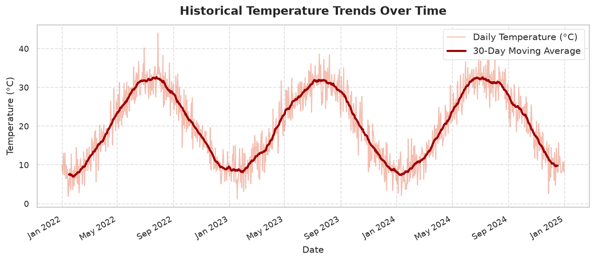
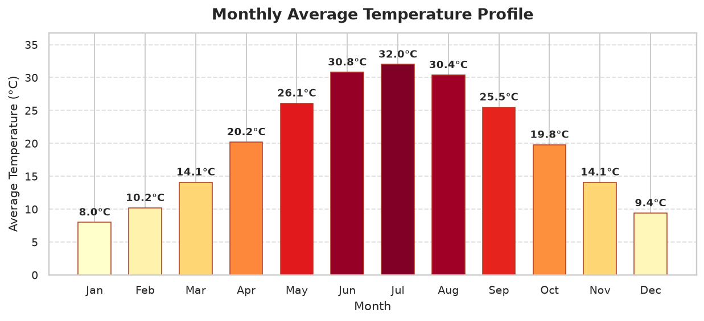
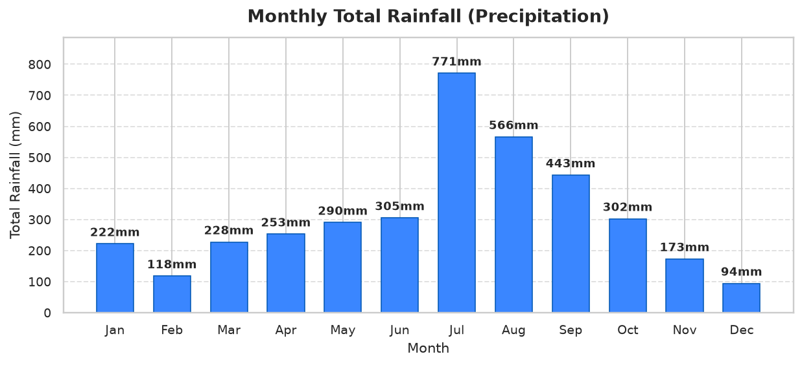
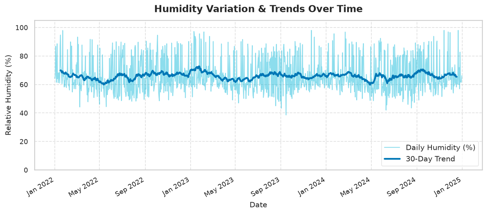
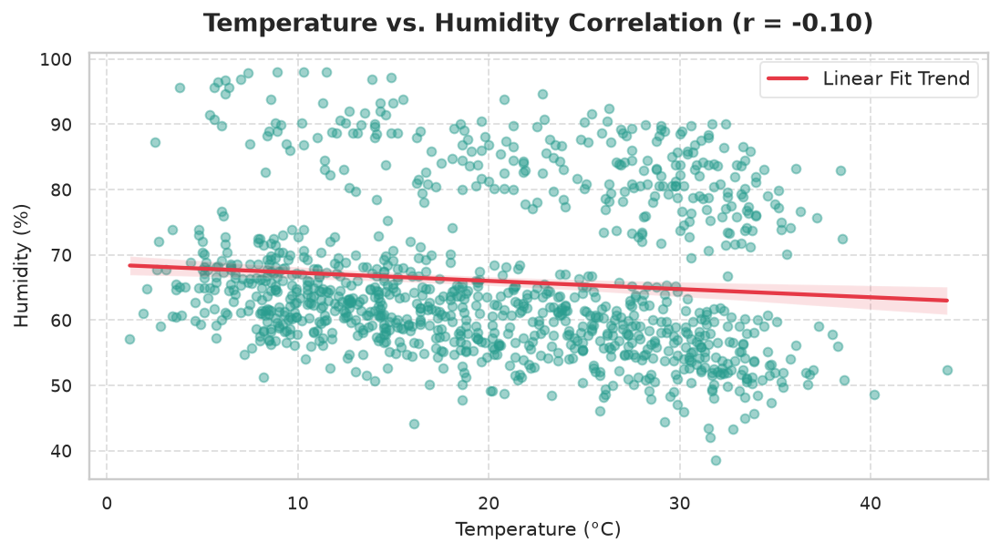
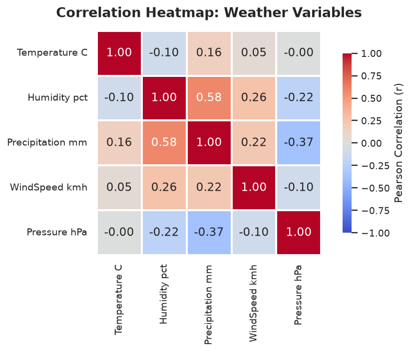
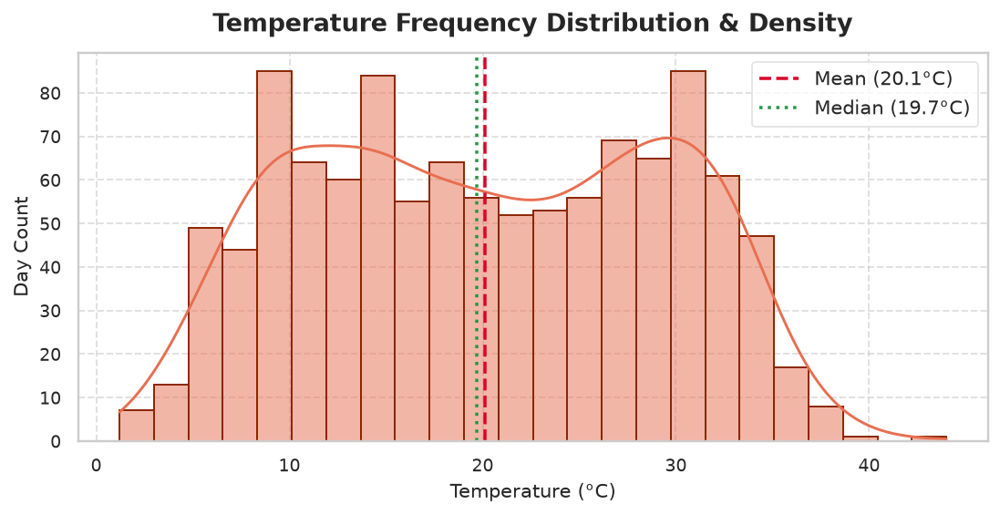
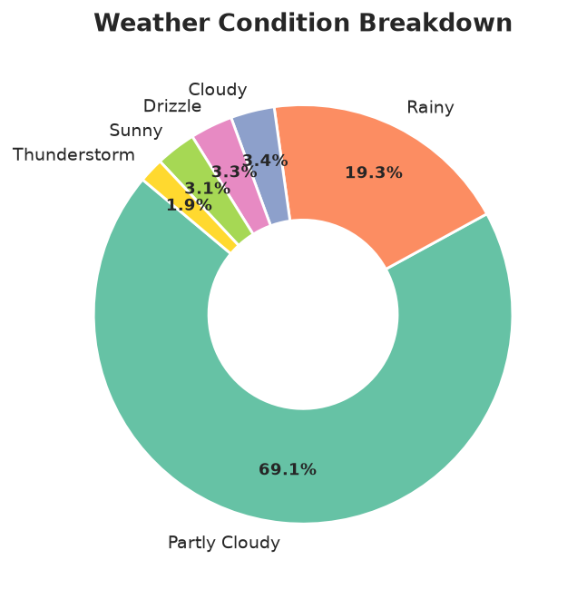

# 🌤️ Weather Data Analyzer

An end-to-end Python data analysis and interactive web dashboard application for historical meteorological datasets. Built with **Pandas**, **NumPy**, **Matplotlib**, **Seaborn**, and **Streamlit**, this project performs automated data cleaning, statistical evaluation, seasonal trend analysis, and natural language smart insights.


---

## 📌 Project Overview

Weather Data Analyzer empowers data analysts, meteorologists, and Python developers to explore, clean, and extract actionable meteorological patterns from CSV datasets without writing repetitive boilerplate code. 

Whether analyzing multi-year climate trends, seasonal monsoon patterns, or temperature-humidity correlations, the platform delivers executive KPI metric cards, high-resolution charts, and auto-generated analytical conclusions.

---

## ✨ Key Features

### 1. 📥 Flexible Data Ingestion
- Upload custom CSV datasets or toggle the pre-loaded multi-year sample dataset (2022–2024).
- Intelligently detects and maps flexible column headers (e.g. `temp`, `Temperature_C`, `rainfall`, `precipitation_mm`, `humidity_pct`, `wind_speed`).
- Instant schema inspection: displays shape, column data types, non-null counts, and head rows.

### 2. 🧹 Automated Data Cleaning
- Identifies and eliminates duplicate records.
- Detects missing values and applies context-aware imputation (linear interpolation for temperatures, forward/backward fill for atmospheric variables, zero-imputation for dry days).
- Converts date records to datetime objects and extracts `Year`, `Month`, `Month_Name`, `Day`, and `Day_Name`.
- Generates a transparent data audit report detailing pre- and post-cleaning metrics.

### 3. 🌡️ Statistical Weather Analysis
- Calculates core summary KPIs: Mean, Maximum, and Minimum Temperatures; Average, Maximum, and Minimum Humidity; Cumulative Precipitation; Average Wind Speed; Atmospheric Pressure.
- Detects record-breaking extreme days:
  - **Hottest Day** (Date, Temp, Sky Condition)
  - **Coldest Day** (Date, Temp, Sky Condition)
  - **Rainiest Day** (Date, Precipitation mm, Sky Condition)
  - **Most Humid Day** (Date, Humidity %, Temp)

### 4. 📅 Monthly & Seasonal Trends
- Month-by-month aggregation of average temperatures, cumulative rainfall, and relative humidity.
- Identifies the hottest and coldest months across the dataset.
- Highlights peak wet and dry seasons.

### 5. 💡 Automated Smart Insights
- Natural-language narrative synthesis summarizing meteorological anomalies and trends:
  - Peak heat and freezing event dates.
  - Pearson correlation interpretation between temperature and humidity.
  - Precipitation frequency and wet-day ratios.
  - Dominant sky conditions and atmospheric stability.

### 6. 📊 8 Statistical Visualizations
- **Temperature Trends Over Time**: Daily fluctuations with a 30-day rolling trendline.
- **Monthly Average Temperature**: Color-gradient bar chart with explicit temperature tags.
- **Monthly Cumulative Rainfall**: Precipitation volume breakdown by calendar month.
- **Humidity Fluctuation**: Time series showing seasonal moisture patterns.
- **Temperature Distribution**: Histogram overlaid with Kernel Density Estimation (KDE), mean, and median markers.
- **Temperature vs. Humidity Scatter Plot**: Bivariate relationship with linear regression fit.
- **Correlation Heatmap**: Full Pearson correlation matrix for all numeric weather variables.
- **Weather Condition Breakdown**: Donut chart displaying sky condition proportions.

### 7. 🎨 Interactive Modern Dashboard
- Built with Streamlit and styled with modern CSS cards and glassmorphic badges.
- Sidebar filters for selective Year and Month slicing.
- Multi-tab Data Explorer with instant cleaned CSV data export.

---

## 🛠️ Tech Stack

| Technology | Purpose |
| :--- | :--- |
| **Python** | Core programming language |
| **Pandas** | Data wrangling, cleaning, temporal extraction, aggregations |
| **NumPy** | Array computations, statistical metrics, normalizations |
| **Matplotlib** | Low-level customized chart rendering and axes formatting |
| **Seaborn** | Advanced statistical plots (KDE distributions, heatmaps, regression) |
| **Streamlit** | Modern, responsive interactive web dashboard |

---

## 📂 Project Structure

```text
weather-data-analyzer/
│── app.py                   # Streamlit web application & UI components
│── weather_analysis.py      # Core data loading, cleaning, KPIs, and plotting engine
│── requirements.txt         # Project dependencies
│── README.md                # Documentation & portfolio overview
│── data/
│   └── weather_data.csv     # Multi-year historical daily weather dataset (2022–2024)
│── screenshots/             # High-resolution chart exports & UI previews
│   ├── temperature_trends.png
│   ├── monthly_avg_temperature.png
│   ├── monthly_rainfall.png
│   ├── humidity_trend.png
│   ├── temperature_distribution.png
│   ├── temp_vs_humidity_scatter.png
│   ├── correlation_heatmap.png
│   └── weather_condition_distribution.png
└── assets/                  # Additional media assets
```

---

## 🚀 Getting Started

### Prerequisites
- Python 3.9 or higher installed on your machine.
- `pip` package manager.

### 1. Clone or Navigate to the Repository
```bash
git clone https://github.com/your-username/weather-data-analyzer.git
cd weather-data-analyzer
```

### 2. Set Up a Virtual Environment (Recommended)
```bash
# Windows
python -m venv venv
venv\Scripts\activate

# macOS / Linux
python3 -m venv venv
source venv/bin/activate
```

### 3. Install Dependencies
```bash
pip install -r requirements.txt
```

### 4. Launch the Streamlit Dashboard
```bash
python -m streamlit run app.py
```
Open your browser and navigate to `http://localhost:8501`.

---

## 📊 Sample Visualizations

Below are sample charts generated directly by the analysis engine:

| Temperature Trends | Monthly Average Temperature |
| :---: | :---: |
|  |  |

| Monthly Rainfall | Humidity Trend |
| :---: | :---: |
|  |  |

| Temperature vs Humidity Correlation | Correlation Matrix Heatmap |
| :---: | :---: |
|  |  |

| Temperature Distribution (KDE) | Sky Condition Distribution |
| :---: | :---: |
|  |  |

---

## 📋 CSV Dataset Format Guide

The application supports CSV files with flexible column names. Recommended columns include:

| Standard Name | Supported Aliases | Type | Example |
| :--- | :--- | :--- | :--- |
| **Date** | `date`, `datetime`, `timestamp`, `time` | String / ISO Date | `2023-07-15` |
| **Temperature_C** | `temp`, `temperature`, `temp_c`, `tavg` | Float | `28.4` |
| **Humidity_pct** | `humidity`, `relative_humidity`, `rh` | Float | `65.0` |
| **Precipitation_mm** | `rainfall`, `precipitation`, `rain_mm` | Float | `12.5` |
| **WindSpeed_kmh** | `wind_speed`, `windspeed`, `wind_kph` | Float | `18.2` |
| **Weather_Condition** | `condition`, `weather`, `summary` | String | `Partly Cloudy` |
| **Pressure_hPa** | `pressure`, `barometer` | Float | `1012.4` |

---

## 🔮 Future Improvements

- [ ] Add 7-day ARIMA / Prophet predictive forecasting for upcoming temperature cycles.
- [ ] Incorporate interactive Plotly 3D atmospheric surface plots.
- [ ] Integration with live OpenWeatherMap API for real-time sensor ingestion.
- [ ] Export automated PDF meteorological summary reports.

---

## 📄 License

This project is licensed under the MIT License - see the LICENSE file for details.
